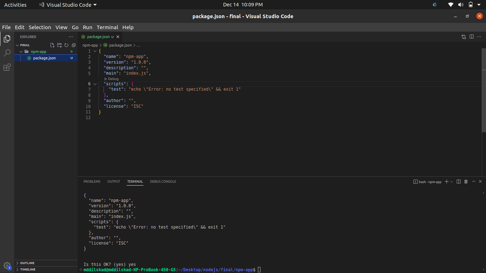

# Version Check
```bash
    ~/Desktop/nodejs/Notes$ node --version
    ~/Desktop/nodejs/Notes$ npm -v
    ~/Desktop/nodejs/Notes$ npm i -g npm@9.2.0 #To install a specific(in this case latest) version
```
# To Create a node project
```bash
    ~/Desktop/nodejs/final/npm-app$ npm init
    Press ^C at any time to quit.
package name: (npm-app) 
version: (1.0.0) 
description: 
entry point: (index.js) 
test command: 
git repository: 
keywords: 
author: 
license: (ISC) 
About to write to /home/mddilshad/Desktop/nodejs/final/npm-app/package.json:

{
  "name": "npm-app",
  "version": "1.0.0",
  "description": "",
  "main": "index.js",
  "scripts": {
    "test": "echo \"Error: no test specified\" && exit 1"
  },
  "author": "",
  "license": "ISC"
}


Is this OK? (yes) yes
```
To avoid the question
```bash
    ~/Desktop/nodejs/final/npm-app$ npm init -y
```
# To Open in VS Code
```bash
   ~/Desktop/nodejs/final/npm-app$ code .
```
# Project Confirmation
