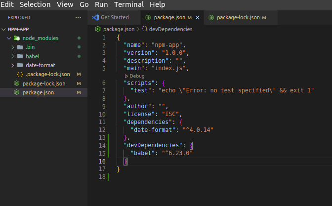

# Version Check
```bash
    ~/Desktop/nodejs/Notes$ node --version
    ~/Desktop/nodejs/Notes$ npm -v
    ~/Desktop/nodejs/Notes$ npm i -g npm@9.2.0 #To install a specific(in this case latest) version
```
# To Create a node project
```bash
    ~/Desktop/nodejs/final/npm-app$ npm init
    Press ^C at any time to quit.
package name: (npm-app) 
version: (1.0.0) 
description: 
entry point: (index.js) 
test command: 
git repository: 
keywords: 
author: 
license: (ISC) 
About to write to /home/mddilshad/Desktop/nodejs/final/npm-app/package.json:

{
  "name": "npm-app",
  "version": "1.0.0",
  "description": "",
  "main": "index.js",
  "scripts": {
    "test": "echo \"Error: no test specified\" && exit 1"
  },
  "author": "",
  "license": "ISC"
}


Is this OK? (yes) yes
```
To avoid the question
```bash
    ~/Desktop/nodejs/final/npm-app$ npm init -y
```
# To Open in VS Code
```bash
   ~/Desktop/nodejs/final/npm-app$ code .
```
# Project Confirmation


# Dependencies that only needed for development time
 ```bash
 ~/Desktop/nodejs/final/npm-app$ npm install babel --save-dev
 ```
 ## In package.json
 

 # To Install package globally
 ```bash
  ~/Desktop/nodejs/final/npm-app$ npm install nodemon --global
 ```
 ## Globally installed packages are not included in package.json. To view them type following command
 ```bash
  npm list -g
 ```
 # To view local and global package installation path
 ```bash
mddilshad@mddilshad-HP-ProBook-450-G5:~/Desktop/nodejs/final/npm-app$ npm root
/home/mddilshad/Desktop/nodejs/final/npm-app/node_modules
mddilshad@mddilshad-HP-ProBook-450-G5:~/Desktop/nodejs/final/npm-app$ npm root -g
/home/mddilshad/.nvm/versions/node/v14.17.6/lib/node_modules
 ```