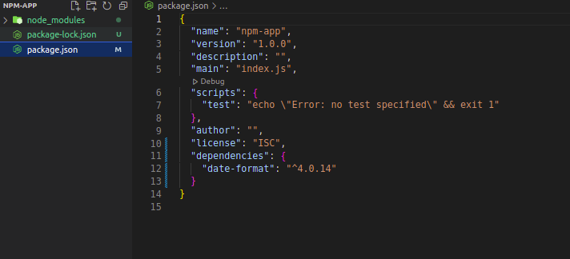

# Installing Node Package on Project folder
## [npmjs.com](https://www.npmjs.com/)
## To install a new package
```bash
    ~/Desktop/nodejs/final/npm-app$ npm install date-format
```
Installing a package will add it to the dependency list of package.json

## The Philosophy
As the project will grow, the node moudle folder will also grow as the dependency list of package.json. All we gotta do is `npm install packagename` in bash command line.
Or without installing I think we can use npmjs.com webpage.

# Import export

`const date = require('date-format')`
- first it will check if its a built in like `const http = require('http')`
- if not it will check in node modules

`const circle = require('./circle')`
- placing ./ means that I am gonna use my own `module.exports = function/class` from some other file.

# `npm list`
A command to list all the package.