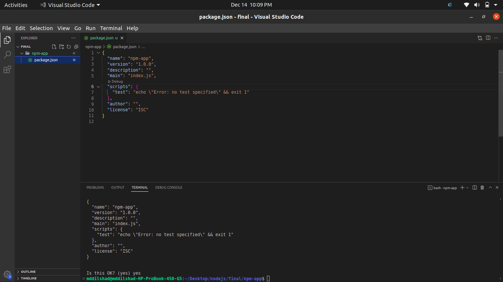
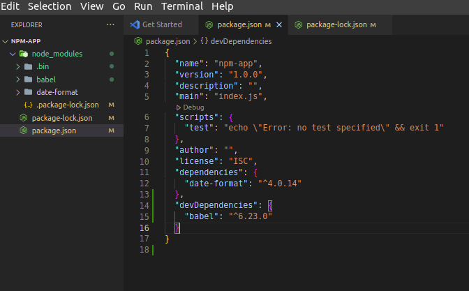
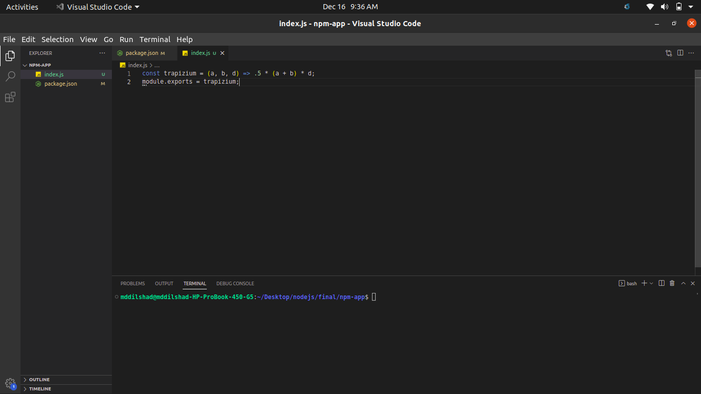

# Version Check
```bash
    ~/Desktop/nodejs/Notes$ node --version
    ~/Desktop/nodejs/Notes$ npm -v
    ~/Desktop/nodejs/Notes$ npm i -g npm@9.2.0 #To install a specific(in this case latest) version
```
# To Create a node project
```bash
    ~/Desktop/nodejs/final/npm-app$ npm init
    Press ^C at any time to quit.
package name: (npm-app) 
version: (1.0.0) 
description: 
entry point: (index.js) 
test command: 
git repository: 
keywords: 
author: 
license: (ISC) 
About to write to /home/mddilshad/Desktop/nodejs/final/npm-app/package.json:

{
  "name": "npm-app",
  "version": "1.0.0",
  "description": "",
  "main": "index.js",
  "scripts": {
    "test": "echo \"Error: no test specified\" && exit 1"
  },
  "author": "",
  "license": "ISC"
}


Is this OK? (yes) yes
```
To avoid the question
```bash
    ~/Desktop/nodejs/final/npm-app$ npm init -y
```
# To Open in VS Code
```bash
   ~/Desktop/nodejs/final/npm-app$ code .
```
# Project Confirmation


# Dependencies that only needed for development time
 ```bash
 ~/Desktop/nodejs/final/npm-app$ npm install babel --save-dev
 ```
 ## In package.json
 

 # To Install package globally
 ```bash
  ~/Desktop/nodejs/final/npm-app$ npm install nodemon --global
 ```
 ## Globally installed packages are not included in package.json. To view them type following command
 ```bash
  npm list -g
 ```
 # To view local and global package installation path
 ```bash
~/Desktop/nodejs/final/npm-app$ npm root
/home/mddilshad/Desktop/nodejs/final/npm-app/node_modules
~/Desktop/nodejs/final/npm-app$ npm root -g
/home/mddilshad/.nvm/versions/node/v14.17.6/lib/node_modules
 ```

 # Upadating and uninstalling packages
 ```bash
  ~/Desktop/nodejs/final/npm-app$ npm outdated
  ~/Desktop/nodejs/final/npm-app$ npm update #this only updated to lasted minor versin
  ~/Desktop/nodejs/final/npm-app$ npm outdated -g #global update
  Package  Current  Wanted  Latest  Location              Depended by
  heroku    7.63.4  7.67.1  7.67.1  node_modules/heroku   global
  nodemon   2.0.19  2.0.20  2.0.20  node_modules/nodemon  global
  ~/Desktop/nodejs/final/npm-app$ npm install -g  nodemon@2.0.20
  ~/Desktop/nodejs/final/npm-app$ npm outdated -g
  Package  Current  Wanted  Latest  Location             Depended by
  heroku    7.63.4  7.67.1  7.67.1  node_modules/heroku  global


  ~/Desktop/nodejs/final/npm-app$ npm un react # uninstalling from local
  ~/Desktop/nodejs/final/npm-app$ npm un nodemon -g # uninstalling from global
 ```
 # Publishing own package
  ```bash
  npm init
  touch index.js
  ```
  

  if you do not have any account, add account
  ```bash
  npm adduser # it will redirect you to the browser and just sign up
  npm login
  #set a package name
  npm publish 
  npm notice 
npm notice 📦  trapizium69@1.0.0
npm notice === Tarball Contents === 
npm notice 76B  index.js    
npm notice 224B package.json
npm notice === Tarball Details === 
npm notice name:          trapizium69                             
npm notice version:       1.0.0                                   
npm notice filename:      trapizium69-1.0.0.tgz                   
npm notice package size:  323 B                                   
npm notice unpacked size: 300 B                                   
npm notice shasum:        b860c40f4383f48c7541381ebc7f79344a69719d
npm notice integrity:     sha512-e2oVgGvNysUtc[...]dB/s33bBFstEQ==
npm notice total files:   2                                       
npm notice 
npm notice Publishing to https://registry.npmjs.org/ with tag latest and default access
+ trapizium69@1.0.0
  ```
```bash
  npm search trapizium69 # to find the package
```
```bash
# Publishing after major,minor or patch update
npm version patch #or minor or major 
npm publish
```